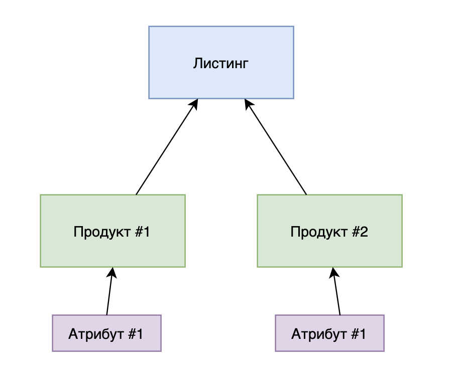

# Листинги

В данном разделе описано общее представление о базовых листингах и работе с ними.

Базовый листинг - это обобщенная модель листинга, которая позволяет работать с одним или несколькими товарами (вариациями).

Листинг бывает 2-х типов: одиночный (single) и вариативный (multiple).
* Одиночный (single) использутеся для создания одного товара, без вариаций, например стол ручной работы.
* Вариативный (multiple) используется для создания группы товаров, которые отличаются по характеристикам, например несколько футболок, которые отличаются по цвету и размеру.

Базовый листинг состоит из:

1. Листинг - основные и общие данные о товаре.
2. Продукт - данные о самом продукте либо вариации (если продуктов несколько).
3. Атрибут - пара из ключа и значения, которая описывает специфичное для продукта свойство (цвет, размер и так далее).

Визуализированная связь продуктов и атрибутов с листингом:



## Создание

Листинг, продукт и атрибут создаются поэтапно. Предположим, что у нас есть две одинаковые футболки от одного прозводителя, но разных цветов, тогда для создания листинга нам потребуется выполнить следующие шаги:

### Создаем базовый листинг:

```json http
{
  "method": "post",
  "url": "/v1/zonesmart/listing/",
  "headers": {
    "Content-Type": "application/json"
  },
  "body": {
	  "title": "Футболка",
	  "description": "Отличная футболка",
	  "sku": "ABCD-1",
	  "currency": "RUB",
    "brand": "Nike"
  }
}
```

В ответ на запрос мы получим примерно следующий результат:

```json
{
    "id": "b458fd2d-26c4-4557-a9f0-0007c20b191a", // идентификатор созданного листинга, с помощью которого мы сможем с ним работать.
    "created": "2020-06-10T19:13:36.099456+03:00", // дата и время создания листинга.
    "modified": "2020-06-10T19:13:36.099729+03:00", // дата и время последнего обновления листинга.
    "is_removed": false, // указывает на то, что листинг был удален "мягко". Для реального удаления требуется повторно отправить запрос на удаление.
    "title": "Футболка", // название листинга.
    "description": "Отличная футболка", // описание листинга.
    "category_name": null, // название категории.
    "currency": "RUB", // валюта, в которой осуществляется продажа товаров.
    "brand": "Nike", // бренд, под которым выпускается продукция.
    "user": 1 // id текущего пользователя, к которому был создан листинг.
}
```

### Создаем продукты к базовому листингу.

Теперь нам потребуется создать по продукту под каждую футболку. Предположим, что у нас есть 2 футболки: зеленая и синяя. Ниже будут приведен запрос на создание одной футболки, второй запрос на создание футболки будет аналогичным, так как в примерах не используется загрузка картинок.

Для этого нам потребуется передать как минимум 2 значения: sku и price.

```json http
{
  "method": "post",
  "url": "/v1/zonesmart/listing/b458fd2d-26c4-4557-a9f0-0007c20b191a/product/",
  "headers": {
    "Content-Type": "application/json"
  },
  "body": {
    "sku": "TSHIRT-1",
    "price": 1000,
    "quantity": 10
  }
}
```

> b458fd2d-26c4-4557-a9f0-0007c20b191a - это id созданного листинга, создание которого было описано в предыдущем пункте.

В ответ на создание мы получим примерно следующий ответ:

```json
{
    "id": "ba6d3417-ee3f-4200-bf5b-ee2f01adedfe", // идентификатор созданного продукта, с помощью которого мы сможем с ним работать.
    "created": "2020-06-10T19:25:32.605693+03:00", // дата и время создания продукта.
    "modified": "2020-06-10T19:25:32.606074+03:00", // дата и время последнего обновления продукта.
    "is_removed": false, // указывает на то, что продукт был удален "мягко". Для реального удаления требуется повторно отправить запрос на удаление.
    "sku": "TSHIRT-1", // SKU продукта.
    "quantity": 10, // количество (в наличии).
    "price": 1000.0, // цена одной единицы.
    "product_code": null, // код товара.
    "condition": null, // состояние товара (NEW, USED, REFURBISHED, OTHER).
    "condition_note": null, // подробное описание состояния товара.
    "listing": "b458fd2d-26c4-4557-a9f0-0007c20b191a", // идентификатор листинга, к которому был создан продукт.
    "main_image": null, // ссылка на главное изображение товара. При создании сначала требуется загрузить картинку отдельным запросом и передать при создании ее id, который возвращается при ее создании.
    "product_code_type": null, // тип кода (ISBN, UPC, EAN и так далее).
    "extra_images": [] // список из ссылок на дополнительные изображения товара. При создании необходимо передать список из id.
}
```

### Создание атрибута к продукту.

Теперь, когда у нас есть продукт, мы должны создать его атрибут (характеристику). Делается это с помощью отдельного запроса:
```json http
{
  "method": "post",
  "headers": {
    "Content-Type": "application/json"
  },
  "url": "/v1/zonesmart/listing/b458fd2d-26c4-4557-a9f0-0007c20b191a/product/ba6d3417-ee3f-4200-bf5b-ee2f01adedfe/attribute/",
  "body": {
	  "name": "Color",
	  "value": "Green"
  }
}
```

> b458fd2d-26c4-4557-a9f0-0007c20b191a - идентификатор созданного ранее листинга.

> ba6d3417-ee3f-4200-bf5b-ee2f01adedfe - идетификатор созданного ранее продукта.

В ответ на запрос мы получим следующий результат:
```json
{
    "product": "ba6d3417-ee3f-4200-bf5b-ee2f01adedfe", // идентификатор атрибута продукта.
    "name": "Color", // наименование атрибута (цвет, размер, тип ткани и так далее).
    "value": "Green" // значение атрибута.
}
```

## Обновление

Предположим, что мы хотим изменить цену для нашего товара, тогда нам необходимо будет выполнить следующий запрос:
```json http
{
  "method": "patch",
  "url": "v1/zonesmart/listing/b458fd2d-26c4-4557-a9f0-0007c20b191a/product/ba6d3417-ee3f-4200-bf5b-ee2f01adedfe/",
  "headers": {
    "Content-Type": "application/json"
  },
  "body": {
	  "price": 2000
  }
}
```
> b458fd2d-26c4-4557-a9f0-0007c20b191a - идентификатор созданного ранее листинга.

> ba6d3417-ee3f-4200-bf5b-ee2f01adedfe - идетификатор созданного ранее продукта.

В ответ на запрос мы получим обновленные данные о нашем продуте:
```json
{
    "id": "ba6d3417-ee3f-4200-bf5b-ee2f01adedfe",
    "created": "2020-06-10T19:25:32.605693+03:00",
    "modified": "2020-06-11T12:13:36.150563+03:00",
    "is_removed": false,
    "sku": "TSHIRT-1",
    "quantity": 0,
    "price": 2000.0,
    "product_code": null,
    "condition": null,
    "condition_note": null,
    "listing": "b458fd2d-26c4-4557-a9f0-0007c20b191a",
    "main_image": null,
    "product_code_type": null,
    "extra_images": []
}
```

## Удаление

Предположим, что мы хотим удалить один из товаров, тогда мы должны сделать следующий запрос, который удалит нашу футболку с SKU - "TSHIRT-1":

```json http
{
  "method": "delete",
  "url": "/v1/zonesmart/listing/b458fd2d-26c4-4557-a9f0-0007c20b191a/product/ba6d3417-ee3f-4200-bf5b-ee2f01adedfe/"
}
```

В ответ мы получим пустой ответ со статусом 204 (No Content).

## Примечания к запросам

Для удобства работы с отображением данных о листингах при запросе к листингу методом GET отдается полная информация (включая продукты и их атрибуты). Предположим, что у нас есть листинг с id **3fad5961-9f4b-4f5e-ba6f-35a8c8b5f077**, тогда при следующем запросе мы получим полные данные о нем:

```json http
{
  "method": "get",
  "url": "/v1/zonesmart/listing/3fad5961-9f4b-4f5e-ba6f-35a8c8b5f077/"
}
```

```json
{
    "id": "3fad5961-9f4b-4f5e-ba6f-35a8c8b5f077",
    "products": [
        {
            "id": "16e43ee4-0765-4795-bf59-7d17df9bfdae",
            "attributes": [
                {
                    "id": "0314ddd4-fea3-413a-996f-c9080932af21",
                    "name": "Color",
                    "value": "Blue",
                    "_order": 0,
                    "product": "16e43ee4-0765-4795-bf59-7d17df9bfdae"
                }
            ],
            "created": "2020-06-11T12:20:49.939190+03:00",
            "modified": "2020-06-11T12:21:22.365553+03:00",
            "is_removed": false,
            "sku": "TSHIRT-2",
            "quantity": 10,
            "price": 1000.0,
            "product_code": null,
            "condition": null,
            "condition_note": null,
            "listing": "3fad5961-9f4b-4f5e-ba6f-35a8c8b5f077",
            "main_image": null,
            "product_code_type": null,
            "extra_images": []
        }
    ],
    "created": "2020-06-11T12:20:18.029700+03:00",
    "modified": "2020-06-11T12:20:18.029931+03:00",
    "is_removed": false,
    "title": "Футболка",
    "description": "Отличная футболка",
    "category_name": null,
    "currency": "RUB",
    "brand": "Nike",
    "user": 1
}
```

## Обновление quantity для связанных листингов

Для того, чтобы обновить quantity у всех продуктов сразу, которые привязаны к базовому листингу, достаточно сделать следующий запрос:

```json http
{
  "method": "put",
  "headers": {
    "Content-Type": "application/json"
  },
  "url": "/v1/zonesmart/listing/b458fd2d-26c4-4557-a9f0-0007c20b191a/product/ba6d3417-ee3f-4200-bf5b-ee2f01adedfe/change_quantity/"
  "body": {
    "quantity": 5
  }
}
```

В ответ на запрос получим следующий ответ:

```json
{
  "detail": "quantity успешно обновлен для всех продуктов связанных с базовым листингом."
}
```

Если к базовому листингу были привязаны другие листинги (eBay, Etsy и так далее), то по аналогичному SKU обновленного продукта они будут найдены и их quantity также будет изменен автоматически. Также, если данные листинги опубликованы, то они автоматически будут синхронизированы на каждой из площадок.
